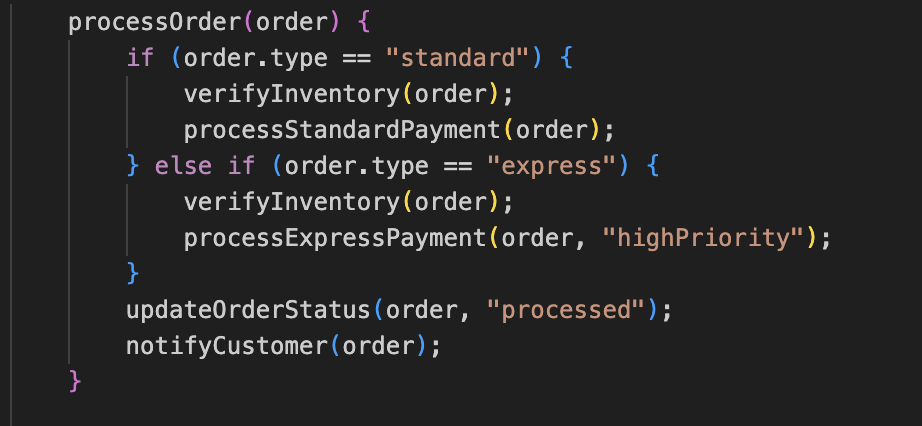
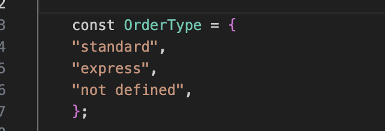
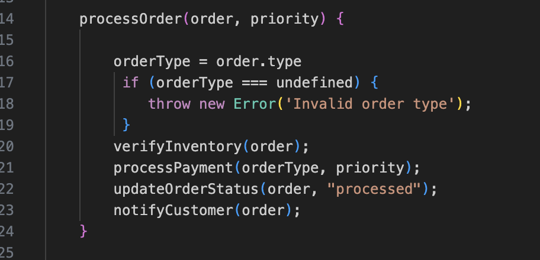
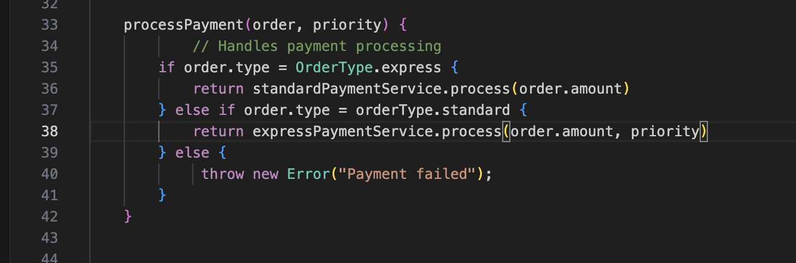

# IronHack-Lab2-SOLID

### What the issue was.
   
   El problema deriva de la modificación de la función si se requiere un nuevo tipo de orden
   
    
### Which SOLID principle it violated.
   Open/close
   Single Responsability
   
### How your change addresses this violation.

  Se crean enums de los orden types y se realiza un refactor de la función processOrder la cual implementa varios metodos.
 
 

### Se realiza un refactor de la función processPayment que maneja el procesamiento de pagos en función del tipo de orden.
 

 ### The benefits your changes bring to the system’s architecture.
   Menos dependencia y desacoplamiento
